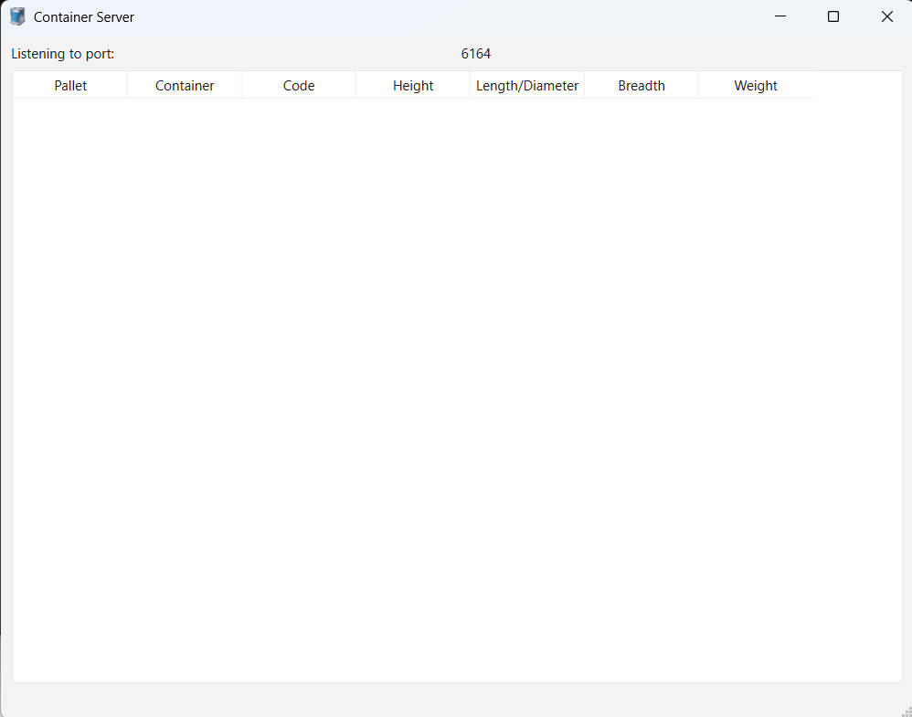
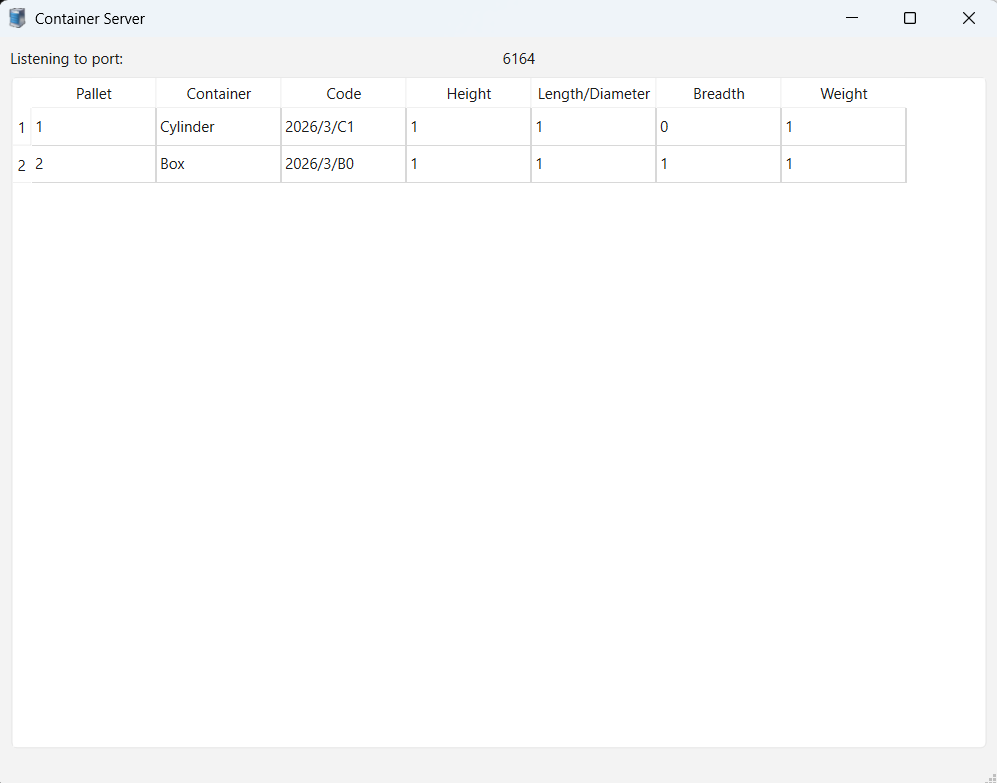

\# Container Server

A Qt/C++ TCP server application that receives and displays container and pallet 

data transmitted by the Container Client application.

\## Description

Container Server listens on TCP port 6164 for incoming XML data from the 

Container Client. When data is received, it is parsed and displayed in a table 

showing pallet and container details. Container codes are validated using regex 

before display.

\## Features

\- TCP server listening on port 6164

\- Displays received container data in a table view

\- Columns: Pallet, Container, Code, Height, Length/Diameter, Breadth, Weight

\- Parses XML data from Container Client

\- Validates container codes with regex

\- Table refreshes automatically when new data is received

\## Screenshots

\## Requirements

\- Qt 6.10.1

\- CMake 3.x or higher

\- Qt Creator 18.0.2

\## How to Run

> \*\*Note:\*\* Start Container Server \*\*before\*\* launching 

> [Container Client](https://github.com/EugeneGouws/Container), 

> otherwise the client will not connect.

1\. Open `CMakeLists.txt` in Qt Creator

2\. Configure the project

3\. Click Run

\## Status

Complete — standalone deployment not yet configured.

\## Author

Eugene Gouws

